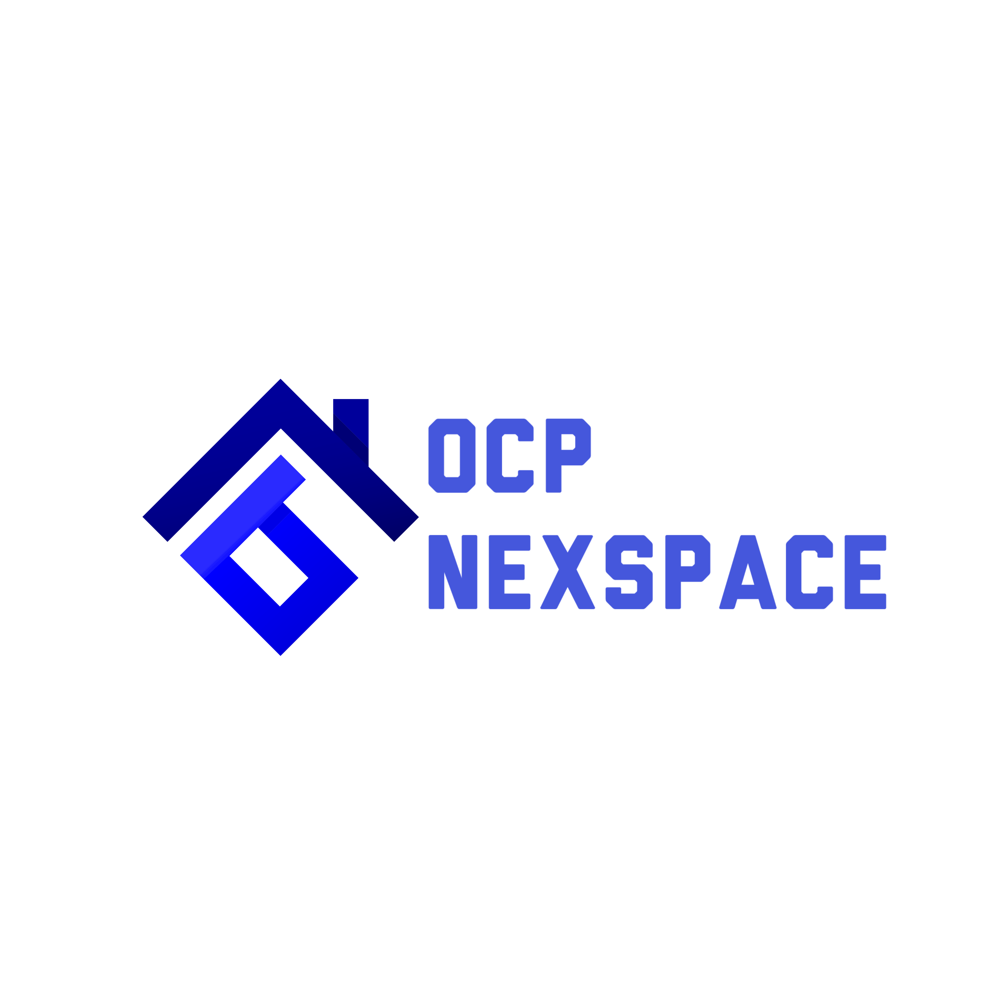

<div align="center">

[](https://opensource.org/licenses/MIT)
[](https://nextjs.org/)
[](https://reactjs.org/)
[](https://www.typescriptlang.org/)
[](https://tailwindcss.com/)

</div>

# 🚀 OCP Nexspace

**Platform Website Profesional untuk Software House Enterprise dengan Sentuhan AI dan Animasi Canggih**

---

## 📋 Table of Contents

- [Overview](#-overview)
- [Key Features](#-key-features)
- [Tech Stack & Architecture](#-tech-stack--architecture)
- [Installation & Setup](#%EF%B8%8F-installation--setup)
- [Configuration](#-configuration)
- [Usage](#-usage)
- [Project Structure](#-project-structure)
- [Contributing](#-contributing)
- [Issues & Feedback](#-issues--feedback)
- [Roadmap](#%EF%B8%8F-roadmap)
- [Credits & Acknowledgements](#-credits--acknowledgements)
- [License](#-license)
- [Copyright](#-copyright)

---

## 🌟 Overview

**OCP Nexspace** adalah website showcase profesional yang dirancang untuk software house enterprise modern. Website ini menyediakan solusi pengembangan perangkat lunak inovatif dan terintegrasi dengan teknologi terkini untuk mendukung transformasi digital bisnis.

Dibangun dengan teknologi terdepan seperti Next.js 16, React 19, dan Three.js, OCP Nexspace menghadirkan pengalaman visual yang memukau dengan animasi yang smooth dan responsif. Website ini menampilkan portofolio proyek, layanan yang ditawarkan, tim profesional, serta testimoni klien dalam satu platform yang elegan dan performant.

### Arsitektur

OCP Nexspace dibangun menggunakan arsitektur modern:

- **Client-Side Rendering (CSR)** dengan Next.js App Router untuk navigasi yang cepat
- **Component-Based Architecture** dengan React 19 dan hooks terbaru
- **Server-Side Rendering (SSR)** untuk SEO optimization
- **Internationalization (i18n)** dengan context API untuk multi-bahasa (Indonesia & English)
- **3D Graphics** rendering dengan Three.js dan WebGL

---

## ✨ Key Features

Website OCP Nexspace dilengkapi dengan berbagai fitur unggulan yang memberikan pengalaman pengguna premium:

### 🎨 Visual & Animasi Canggih

**Fitur**: Animasi smooth dengan Motion library, efek glassmorphism, dan 3D graphics

- **Modul**: [`LightRays.tsx`](./src/components/LightRays.tsx), [`FloatingSymbols.tsx`](./src/components/FloatingSymbols.tsx)
- **Deskripsi**: Implementasi efek cahaya dinamis berbasis WebGL yang mengikuti mouse movement, floating symbols dengan animasi natural, dan rotating text dengan spring animation yang memberikan kesan premium dan modern.

### 🌍 Multi-Language Support

**Fitur**: Dukungan dua bahasa (Indonesia & English) dengan switching yang seamless

- **Modul**: [`src/lib/translations/`](./src/lib/translations/), [`language-context.tsx`](./src/lib/language-context.tsx)
- **Deskripsi**: Sistem internationalization lengkap dengan React Context API, memungkinkan pengguna untuk beralih bahasa secara real-time tanpa reload halaman. Semua konten dari navigasi, hero section, hingga footer tersedia dalam dua bahasa.

### 📱 Responsive Design

**Fitur**: Tampilan yang optimal di semua ukuran layar (desktop, tablet, mobile)

- **Modul**: Seluruh komponen menggunakan Tailwind CSS responsive utilities
- **Deskripsi**: Design system yang konsisten dengan breakpoint md, lg untuk memastikan user experience yang sempurna di berbagai device. Menggunakan grid system dan flexbox untuk layout yang adaptif.

### 🧩 Component Library

**Fitur**: Koleksi komponen UI yang reusable dan konsisten

- **Modul**: [`src/components/ui/`](./src/components/ui/)
- **Deskripsi**: Button, Card, dan komponen UI lainnya yang dibangun dengan class-variance-authority untuk variant management, memastikan konsistensi design di seluruh aplikasi.

### 🎯 Landing Page Sections

**Fitur**: Section-section yang comprehensive untuk showcase bisnis

- **Modul**:
  - [`Hero.tsx`](./src/components/Hero.tsx) - Hero section dengan rotating text dan dashboard preview
  - [`Features.tsx`](./src/components/Features.tsx) - Showcase layanan utama
  - [`AboutUs.tsx`](./src/components/AboutUs.tsx) - Profil perusahaan
  - [`Team.tsx`](./src/components/Team.tsx) - Tim profesional
  - [`Testimonials.tsx`](./src/components/Testimonials.tsx) - Testimoni klien
  - [`WhyChooseUs.tsx`](./src/components/WhyChooseUs.tsx) - Keunggulan kompetitif
  - [`LogoTicker.tsx`](./src/components/LogoTicker.tsx) - Logo partner/klien
- **Deskripsi**: Setiap section dirancang dengan perhatian detail tinggi, menampilkan informasi yang relevan dengan visual yang menarik dan animasi yang profesional.

### 🚀 Smooth Scrolling

**Fitur**: Scrolling experience yang smooth menggunakan Lenis

- **Modul**: [`SmoothScroll.tsx`](./src/components/SmoothScroll.tsx)
- **Deskripsi**: Implementasi smooth scroll dengan Lenis library yang memberikan pengalaman scrolling natural dan premium, meningkatkan overall user experience.

### 📊 Dynamic Content

**Fitur**: Sistem konten dinamis untuk blog dan proyek

- **Modul**: [`src/data/blogs.ts`](./src/data/blogs.ts), [`src/data/projects.ts`](./src/data/projects.ts)
- **Deskripsi**: Data structure terorganisir untuk mengelola konten blog dan portfolio proyek, dengan search dan filtering capabilities.

### ⚡ Performance Optimization

**Fitur**: React Compiler untuk optimisasi performa

- **Modul**: Next.js config dengan `reactCompiler: true`
- **Deskripsi**: Memanfaatkan React Compiler experimental untuk automatic memoization dan optimisasi rendering, menghasilkan aplikasi yang lebih cepat dan efisien.

---

## 🧱 Tech Stack & Architecture

### Core Technologies

- **Framework**: [Next.js 16.0.5](https://nextjs.org/) - React framework dengan App Router
- **Library**: [React 19.2.0](https://reactjs.org/) - Library UI dengan React Compiler
- **Language**: [TypeScript 5.x](https://www.typescriptlang.org/) - Type-safe JavaScript
- **Styling**: [TailwindCSS 4.0](https://tailwindcss.com/) - Utility-first CSS framework
- **Runtime**: [Bun](https://bun.sh/) - Fast JavaScript runtime (development)

### UI & Animation Libraries

- **Animation**: [Motion 12.x](https://motion.dev/) - Production-ready animation library
- **Smooth Scroll**: [Lenis 1.3](https://lenis.studio/) - Smooth scrolling
- **Icons**: [Lucide React](https://lucide.dev/) - Beautiful icon library
- **3D Graphics**: [Three.js 0.167](https://threejs.org/) - WebGL 3D library
- **WebGL Utils**: [OGL 1.0](https://github.com/oframe/ogl) - Minimal WebGL library
- **Post-processing**: [Postprocessing 6.36](https://github.com/pmndrs/postprocessing) - Post-processing library

### Development Tools

- **Styling Utilities**:
  - `class-variance-authority` - Type-safe variant management
  - `clsx` - Conditional className utility
  - `tailwind-merge` - Tailwind class merging
- **TypeScript Types**: Type definitions untuk Node, React, React DOM, Three.js
- **Build Tools**: Babel React Compiler plugin untuk optimisasi

### Architecture Flow

```
User Request
    ↓
Next.js App Router (SSR/CSR)
    ↓
React Components (dengan i18n Context)
    ↓
UI Components (styled dengan TailwindCSS)
    ↓
Animations (Motion + Three.js WebGL)
    ↓
Optimized Rendering (React Compiler)
```

---

## ⚙️ Installation & Setup

### Prasyarat

Pastikan sistem Anda memiliki:

- **Node.js**: >= 18.x (direkomendasikan 20.x)
- **Bun** atau **npm/yarn/pnpm**: Package manager
- **Git**: Version control system

### Langkah Instalasi

1. **Clone Repository**

```bash
git clone https://github.com/zeative/ocp-nexspace.git
cd ocp-nexspace
```

2. **Install Dependencies**

Menggunakan Bun (direkomendasikan):

```bash
bun install
```

Atau menggunakan npm:

```bash
npm install
```

3. **Jalankan Development Server**

```bash
bun dev
# atau
npm run dev
```

4. **Akses Aplikasi**

Buka browser dan akses:

```
http://localhost:3000
```

### Build untuk Production

Untuk membuat production build:

```bash
bun run build
# atau
npm run build
```

Jalankan production build:

```bash
bun start
# atau
npm start
```

---

## 🔧 Configuration

### Environment Variables

Website ini menggunakan konfigurasi publik yang didefinisikan dalam [`src/consts.ts`](./src/consts.ts). Tidak ada environment variables sensitif yang diperlukan untuk development.

**Metadata Configuration:**

```typescript
// src/consts.ts
export const METADATA: Metadata = {
  metadataBase: new URL("https://ocp-nexspace.vercel.app"),
  title: "OCP Nexspace",
  description: "OCP Nexspace, software house profesional di Indonesia...",
  // ... konfigurasi lainnya
};
```

### Next.js Configuration

Konfigurasi Next.js dapat diubah di [`next.config.ts`](./next.config.ts):

```typescript
const nextConfig: NextConfig = {
  reactCompiler: true, // Enable React Compiler
  images: {
    remotePatterns: [
      {
        protocol: "https",
        hostname: "images.unsplash.com",
      },
    ],
  },
};
```

### Tailwind Configuration

Styling dapat dikustomisasi melalui Tailwind CSS configuration system. Website ini menggunakan TailwindCSS 4.0 dengan custom theme yang didefinisikan di global CSS.

---

## 🧪 Usage

### Cara Menggunakan Website

1. **Homepage**: Akses halaman utama di `/` untuk melihat hero section, fitur layanan, dan informasi perusahaan
2. **Projects**: Navigasi ke `/projects` untuk melihat studi kasus dan portfolio proyek
3. **Blog**: Kunjungi `/blog` untuk membaca artikel dan tutorial dari tim
4. **Language Toggle**: Klik tombol language di navbar untuk beralih antara Bahasa Indonesia dan English

### Untuk Developer

**Menambahkan Komponen Baru:**

```typescript
// src/components/NewComponent.tsx
"use client";

import { useLanguage } from "@/lib/language-context";

export function NewComponent() {
  const { t } = useLanguage();

  return <div className="container mx-auto">{/* Your component code */}</div>;
}
```

**Menambahkan Translation:**

```typescript
// src/lib/translations/id.ts
export const id: Translations = {
  // ... existing translations
  newSection: {
    title: "Judul Baru",
    description: "Deskripsi dalam bahasa Indonesia",
  },
};
```

**Menggunakan Motion untuk Animasi:**

```typescript
import { motion } from "motion/react";

<motion.div
  initial={{ opacity: 0, y: 20 }}
  animate={{ opacity: 1, y: 0 }}
  transition={{ duration: 0.5 }}
>
  Content
</motion.div>;
```

---

## 📁 Project Structure

```
ocp-nexspace/
├── public/                    # Static assets
│   ├── meta/                 # Favicon, manifest, og images
│   └── people/               # Team member photos
├── src/
│   ├── app/                  # Next.js App Router
│   │   ├── layout.tsx       # Root layout
│   │   ├── page.tsx         # Homepage
│   │   ├── projects/        # Projects page
│   │   └── blog/            # Blog page
│   ├── components/           # React components
│   │   ├── ui/              # Reusable UI components (Button, Card)
│   │   ├── layout/          # Layout components
│   │   ├── Hero.tsx         # Hero section dengan animasi
│   │   ├── Features.tsx     # Services showcase
│   │   ├── AboutUs.tsx      # Company profile
│   │   ├── Team.tsx         # Team section
│   │   ├── Testimonials.tsx # Client testimonials
│   │   ├── WhyChooseUs.tsx  # Value propositions
│   │   ├── LogoTicker.tsx   # Partner logos
│   │   ├── Footer.tsx       # Footer
│   │   ├── Navbar.tsx       # Navigation bar
│   │   ├── FloatingSymbols.tsx  # 3D floating animations
│   │   ├── LightRays.tsx    # WebGL light effects
│   │   ├── RotatingText.tsx # Animated rotating text
│   │   └── SmoothScroll.tsx # Smooth scroll wrapper
│   ├── lib/                  # Utilities & helpers
│   │   ├── translations/    # i18n translations (id, en)
│   │   ├── language-context.tsx  # Language context provider
│   │   └── utils.ts         # Utility functions
│   ├── data/                 # Static data
│   │   ├── blogs.ts         # Blog posts data
│   │   └── projects.ts      # Portfolio projects data
│   └── consts.ts            # Global constants & metadata
├── .gitignore               # Git ignore rules
├── next.config.ts           # Next.js configuration
├── tsconfig.json            # TypeScript configuration
├── postcss.config.mjs       # PostCSS configuration
├── components.json          # Shadcn/ui components config
├── package.json             # Dependencies & scripts
└── README.md                # This file
```

### Penjelasan Folder Utama

- **`src/app/`**: Struktur routing menggunakan Next.js App Router (file-system based routing)
- **`src/components/`**: Komponen React yang modular dan reusable, terorganisir berdasarkan fungsi
- **`src/lib/`**: Utilities, helpers, dan context providers untuk fungsi global
- **`src/data/`**: Data statis untuk blog dan proyek yang dapat dengan mudah di-update
- **`public/`**: Asset statis yang dapat diakses langsung (images, fonts, icons)

---

## 🤝 Contributing

Kami menyambut kontribusi dari developer untuk meningkatkan OCP Nexspace! Berikut cara berkontribusi:

### Flow Kontribusi

1. **Fork Repository** ini ke akun GitHub Anda
2. **Clone** fork Anda ke local machine
3. **Buat Branch** baru untuk fitur/fix Anda:
   ```bash
   git checkout -b feature/nama-fitur-anda
   ```
4. **Commit Changes** dengan pesan yang jelas:
   ```bash
   git commit -m "feat: menambahkan fitur X"
   ```
5. **Push** ke branch Anda:
   ```bash
   git push origin feature/nama-fitur-anda
   ```
6. **Buat Pull Request** dengan deskripsi lengkap perubahan Anda

### Code Style Guidelines

- Gunakan **TypeScript** untuk semua file baru
- Follow **component naming convention**: PascalCase untuk komponen, camelCase untuk utilities
- Gunakan **Tailwind CSS** untuk styling, hindari inline styles atau CSS-in-JS kecuali untuk kasus khusus
- Write **meaningful commit messages** mengikuti conventional commits (feat, fix, docs, style, refactor, test, chore)
- Pastikan code Anda **type-safe** dan tidak ada TypeScript errors

### Testing

Sebelum submit PR, pastikan:

- Development server berjalan tanpa error: `bun dev`
- Production build berhasil: `bun run build`
- Tidak ada TypeScript errors: `tsc --noEmit`
- Testing manual untuk fitur yang ditambahkan/diubah

---

## 🐞 Issues & Feedback

### Melaporkan Bug

Jika Anda menemukan bug, silakan buat issue di GitHub:

1. Buka [Issues Page](https://github.com/zeative/ocp-nexspace/issues)
2. Klik **"New Issue"**
3. Berikan detail lengkap:
   - **Deskripsi bug**: Jelaskan masalah yang terjadi
   - **Steps to reproduce**: Langkah-langkah untuk mereproduksi bug
   - **Expected behavior**: Behavior yang diharapkan
   - **Actual behavior**: Behavior yang terjadi
   - **Screenshots**: Jika memungkinkan
   - **Environment**: Browser, OS, Node version

### Request Fitur Baru

Punya ide untuk fitur baru? Kami ingin mendengarnya!

1. Buka [Issues Page](https://github.com/zeative/ocp-nexspace/issues)
2. Gunakan label **"enhancement"** atau **"feature request"**
3. Jelaskan:
   - Masalah yang ingin diselesaikan
   - Solusi yang Anda usulkan
   - Alternatif yang sudah dipertimbangkan
   - Manfaat untuk user/project

### Feedback Umum

Untuk feedback umum atau diskusi, silakan buat discussion di GitHub Discussions atau hubungi kami melalui email di info@ocp-nexspace.com.

---

## 🗺️ Roadmap

Berikut adalah rencana pengembangan OCP Nexspace ke depan:

### Q1 2025

- [ ] CMS Integration untuk blog management
- [ ] Contact form dengan email notification
- [ ] Live chat support integration
- [ ] Performance optimization (PWA, caching strategy)

### Q2 2025

- [ ] Dark/Light mode toggle
- [ ] Advanced filtering untuk projects & blog
- [ ] Case study detail pages
- [ ] Integration dengan analytics dashboard

### Q3 2025

- [ ] Authentication system untuk client portal
- [ ] Project management dashboard
- [ ] Team collaboration tools
- [ ] API documentation

### Future Enhancements

- [ ] Mobile app (React Native)
- [ ] Multi-region support
- [ ] Advanced SEO optimization
- [ ] A/B testing framework
- [ ] Integration dengan CRM systems

---

## 🙏 Credits & Acknowledgements

OCP Nexspace dibangun dengan dukungan berbagai teknologi open source dan kontribusi komunitas:

### Development Team

- **Zeative Media** - Pengembangan dan design keseluruhan website

### Open Source Projects

Terima kasih kepada maintainers dan kontributor dari library open source yang digunakan:

- [Next.js](https://nextjs.org/) oleh Vercel - React framework yang powerful
- [React](https://reactjs.org/) oleh Meta - UI library yang revolusioner
- [TailwindCSS](https://tailwindcss.com/) oleh Tailwind Labs - Utility-first CSS framework
- [Three.js](https://threejs.org/) - 3D graphics library yang luar biasa
- [Motion](https://motion.dev/) - Animation library yang production-ready
- [Lucide Icons](https://lucide.dev/) - Beautiful & consistent icon set
- [Lenis](https://lenis.studio/) - Smooth scrolling library
- Semua contributors di npm packages yang kami gunakan

### Design Inspiration

Design website terinspirasi dari best practices modern web design, dengan fokus pada user experience dan visual excellence.

---

## 📜 License

Proyek ini dilisensikan di bawah **MIT License**.

MIT License adalah lisensi open source yang permisif, memungkinkan Anda untuk:

- ✅ Menggunakan source code untuk proyek komersial
- ✅ Memodifikasi dan mendistribusikan
- ✅ Menggunakan secara private
- ⚠️ Dengan tetap menyertakan copyright notice dan permission notice

Untuk detail lengkap, lihat file [LICENSE](./LICENSE).

---

## © Copyright

**© 2025 Zeative Media. All rights reserved.**

Website ini adalah properti intelektual dari Zeative Media. Penggunaan, modifikasi, dan distribusi mengikuti ketentuan MIT License sebagaimana tercantum di atas.

---

<div align="center">

**Dibuat dengan ❤️ oleh [Zeative Media](https://github.com/zeative)**

⭐ Jika proyek ini bermanfaat, berikan star di GitHub!

[Website](https://ocp-nexspace.vercel.app) • [Issues](https://github.com/zeative/ocp-nexspace/issues) • [Discussions](https://github.com/zeative/ocp-nexspace/discussions)

</div>
